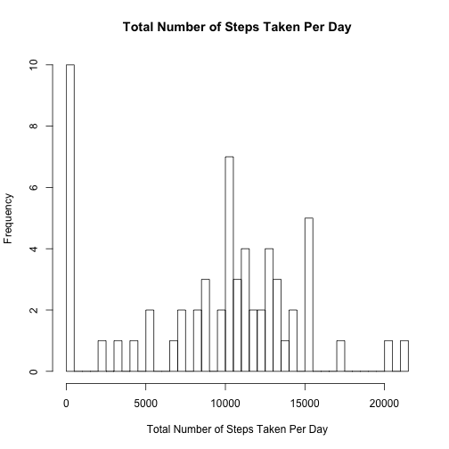
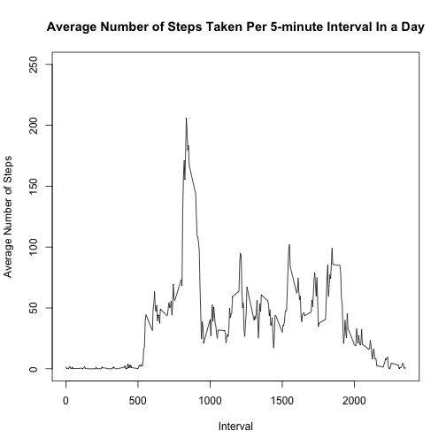
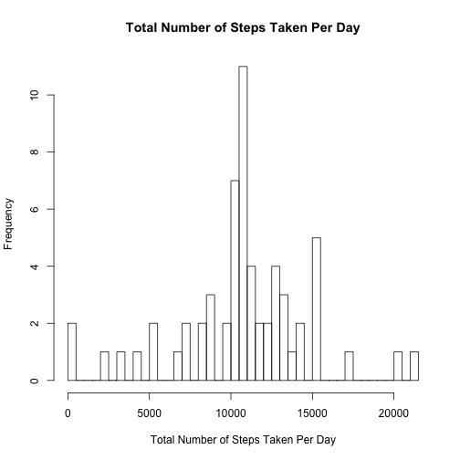
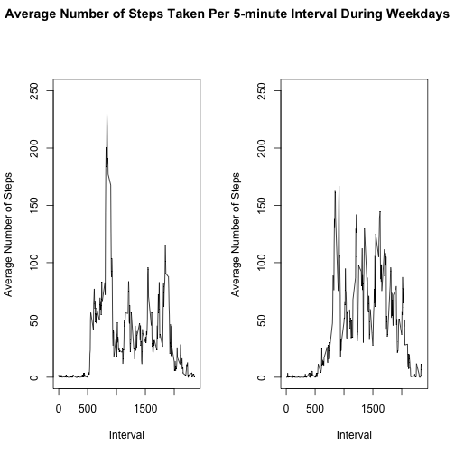

Loading and preprocessing the data


```r
#setwd("./RepData_PeerAssessment1/")
unzip("activity.zip")
ActData <- read.csv("activity.csv", header = TRUE, sep = ",")
```

Calcualting the mean total number of steps taken per day


```r
TotalNumOfStepsPerDay = aggregate(ActData$steps, by = list(ActData$date), sum, na.rm = TRUE)
hist(TotalNumOfStepsPerDay$x, breaks = length(TotalNumOfStepsPerDay$Group.1), main = "Total Number of Steps Taken Per Day", xlab = "Total Number of Steps Taken Per Day")
```



```r
MeanStep = mean(TotalNumOfStepsPerDay$x, na.rm = TRUE)
MedianStep = median(TotalNumOfStepsPerDay$x, na.rm = TRUE)
cat("Mean Number of Steps Taken Per Day: ", MeanStep)
```

```
## Mean Number of Steps Taken Per Day:  9354.23
```

```r
cat("Median Number of Steps Taken Per Day: ", MedianStep)
```

```
## Median Number of Steps Taken Per Day:  10395
```

Outputing the average daily activity pattern


```r
AverageNumOfStepsPerInt = aggregate(ActData$steps, by = list(ActData$interval), mean, na.rm = TRUE)
plot(AverageNumOfStepsPerInt, type = "l", main = "Average Number of Steps Taken Per 5-minute Interval In a Day", xlab = "Interval", ylab = "Average Number of Steps", ylim=c(0, 250))
```



```r
MaxNumOfStepsInt = AverageNumOfStepsPerInt$Group.1[which.max(AverageNumOfStepsPerInt$x)]
cat("The Interval with Maximal Number of Steps Per 5-minute Interval In a Day: ", MaxNumOfStepsInt)
```

```
## The Interval with Maximal Number of Steps Per 5-minute Interval In a Day:  835
```

Imputing missing values  
Note: NewActData is the new data set where missing data is replaced with the mean for the 5-minute interval  
Report: The mean and median are different from the first part of this assignment. Imputing missing data on the estimates of steps increases the mean and median value. 


```r
TotalNumOfMissingVal = sum(is.na(ActData$steps))
NewActData <- ActData
NewActData[(which(is.na(NewActData$steps))),1] <- rep(AverageNumOfStepsPerInt$x,8)
NewTotalNumOfStepsPerDay = aggregate(NewActData$steps, by = list(NewActData$date), sum, na.rm = TRUE)
hist(NewTotalNumOfStepsPerDay$x, breaks = length(NewTotalNumOfStepsPerDay$Group.1), main = "Total Number of Steps Taken Per Day", xlab = "Total Number of Steps Taken Per Day")
```



```r
NewMeanStep = mean(NewTotalNumOfStepsPerDay$x, na.rm = TRUE)
NewMedianStep = median(NewTotalNumOfStepsPerDay$x, na.rm = TRUE)
cat("Mean Number of Steps Taken Per Day after Imputing: ", NewMeanStep)
```

```
## Mean Number of Steps Taken Per Day after Imputing:  10766.19
```

```r
cat("Median Number of Steps Taken Per Day after Imputing: ", NewMedianStep)
```

```
## Median Number of Steps Taken Per Day after Imputing:  10766.19
```

Activity pattern between weekdays and weekends  
Note: DaysData is the new factor used to indicate "weekdays" and "weekends"


```r
DaysData =  weekdays(as.Date(NewActData$date))
DaysData[which (DaysData %in% c("Saturday", "Sunday"))] <- "Weekends"
DaysData[which (DaysData %in% c("Monday", "Tuesday", "Wednesday", "Thursday", "Friday"))] <- "Weekdays"
WeekActData <- cbind(NewActData,DaysData)
NonWkdData <- subset(WeekActData[which(WeekActData$DaysData == "Weekdays"),])
WkdData <- subset(WeekActData[which(WeekActData$DaysData == "Weekends"),])
NonWkdAverageNumOfStepsPerInt = aggregate(NonWkdData$steps, by = list(NonWkdData$interval), mean, na.rm = TRUE)
WkdAverageNumOfStepsPerInt = aggregate(WkdData$steps, by = list(WkdData$interval), mean, na.rm = TRUE)
par(mfrow = c(1,2), oma = c(0, 0, 2, 0))
plot(NonWkdAverageNumOfStepsPerInt, type = "l",xlab = "Interval", ylab = "Average Number of Steps",  ylim=c(0, 250))
plot(WkdAverageNumOfStepsPerInt, type = "l", xlab = "Interval", ylab = "Average Number of Steps", ylim=c(0, 250))
title(main = "Average Number of Steps Taken Per 5-minute Interval During Weekdays", outer = TRUE)
```




